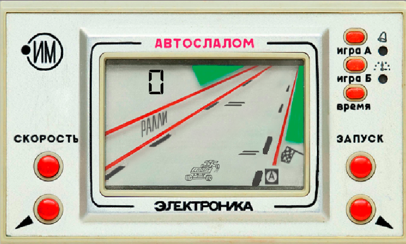

# Игра гонки "Автослалом" электроника
### Это переделка игры "Электроника ИМ-23. Автослалом".
#### Игроку нужно обьезжать препятствия, тем самым набирать очки.
#### Со временем сложность игры увеличивается, но её можно регулировать и вручную.
#### Так же можно выбрать начальную сложность игры (А и Б), а ещё скоро будет добавлен режим игры на время.
---
### Игра сделана на языке python с использованием библиотеки pygame.
---
### Для того чтобы запустить игру можно воспользоваться файлам exe, либо же открыть код в редакторе и установить pygame c помощью pip
---

